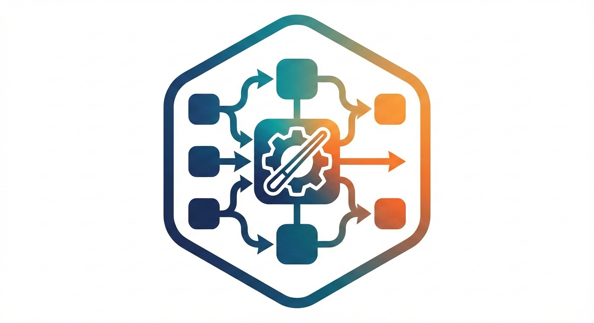
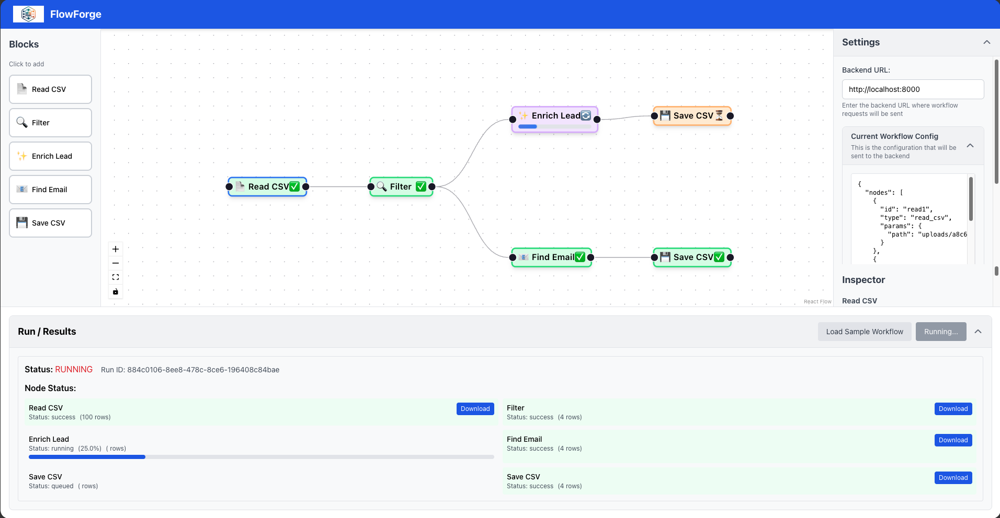
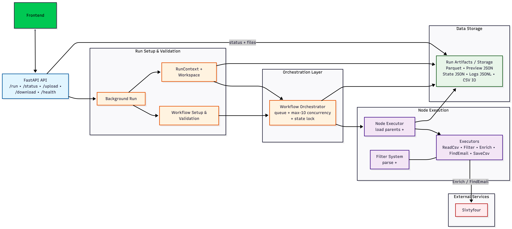
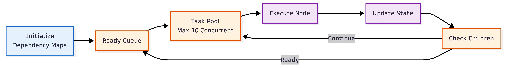
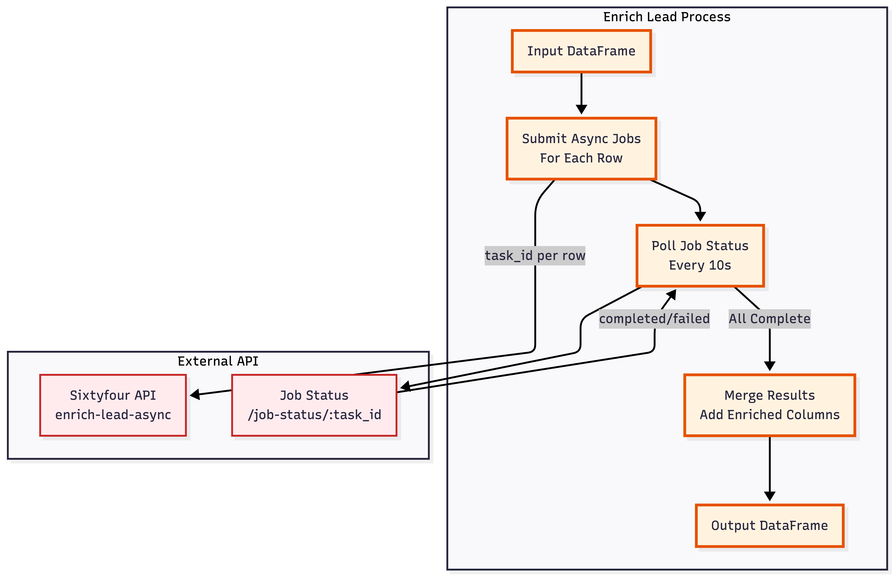

#  FlowForge - Workflow Engine



Link : https://flowforge-6a1b1.web.app/

A visual workflow orchestration system for ai enabled workflows. FlowForge enables users to build complex data workflows using a drag-and-drop interface, with support for CSV processing, data enrichment, filtering, and more.




## Brief Overview

FlowForge is a full-stack application that provides a visual workflow builder for creating and executing data processing pipelines. The system consists of:

- **Frontend**: A React-based visual DAG (Directed Acyclic Graph) editor built with React Flow, allowing users to drag-and-drop nodes and connect them to create workflows 

  [FlowForge Web App](https://flowforge-6a1b1.web.app/)

- **Backend**: A FastAPI-based workflow orchestration engine that executes workflows asynchronously using a queue-based parallel execution system 

  [FlowForge Backend](https://backend-app-production-b88e.up.railway.app)

**Note**: The frontend can be configured to connect to any backend URL through the settings panel.

## Overall Architecture



### Key Features

- **Visual Workflow Builder**: Intuitive drag-and-drop interface for creating workflows
- **Parallel Execution**: Async queue-based orchestration for maximum throughput
- **Node Types**: Support for multiple block types including:
  - `read_csv`: Load CSV files
  - `filter`: Filter data using rules or expressions
  - `enrich_lead`: Enrich leads using Sixtyfour API
  - `find_email`: Find email addresses
  - `save_csv`: Save results to CSV
- **Real-time Status Updates**: Poll workflow execution status and view intermediate results
- **Data Preview**: View previews of data at each node in the workflow
- **File Management**: Upload CSV files and download results


## Local Installation Instructions

### Prerequisites

- Python 3.11+
- Node.js 18+ and npm
- Docker and Docker Compose (optional, for containerized deployment)

### Backend Setup

#### Option 1: Docker Hub

#### Pre-built Image on Docker Hub

You can also pull the latest pre-built backend image from Docker Hub:

```bash
docker pull cheersanimesh/backend-app
```

See [Docker Hub: cheersanimesh/backend-app](https://hub.docker.com/r/cheersanimesh/backend-app)

#### Option 2: Docker Hub

1. Navigate to the backend directory:
```bash
cd backend
```

2. Build the Docker image:
```bash
docker build -t flowforge-backend .
```

3. Run the container:
```bash
docker run -d \
  -p 8000:8000 \
  -v $(pwd)/runs:/app/runs \
  -v $(pwd)/uploads:/app/uploads \
  --name flowforge-backend \
  --SIXTYFOUR_API_KEY <API_KEY> \
  flowforge-backend
```


#### Option 3: Python Installation

1. Navigate to the backend directory:
```bash
cd backend
```

2. Create a virtual environment (recommended):
```bash
python3 -m venv venv
source venv/bin/activate  # On Windows: venv\Scripts\activate
```

3. Install dependencies:
```bash
pip install -r requirements.txt
```

4. Set up environment variables (if needed):
```bash
# Create a .env file with any required configuration
# For example, Sixtyfour API credentials if using enrich_lead or find_email nodes
```

5. Run the application:
```bash
# Using uvicorn directly
uvicorn app:app --host 0.0.0.0 --port 8000 --reload
```


### Frontend Setup


1. Navigate to the frontend directory:
```bash
cd frontend
```

2. Install dependencies:
```bash
npm install
```

3. Start the development server:
```bash
npm run dev
```

The frontend will be available at `http://localhost:3000`


## Architecture & Design Choices


#### 1. Async Queue-Based Workflow Orchestration



**Figure:** Workflow orchestration pipeline

The backend implements an async queue-based orchestration system (`WorkflowOrchestrator`) that enables parallel execution of workflow nodes:

- **Parallel Execution**: Nodes are executed as soon as their parent dependencies are satisfied, maximizing throughput
- **Queue Management**: Uses `asyncio.Queue` to manage ready nodes, ensuring efficient task scheduling
- **Concurrency Control**: Limits concurrent node execution (default: 10 nodes) to prevent resource exhaustion
- **State Management**: Thread-safe state updates using `asyncio.Lock` to ensure consistent workflow state

**Key Components:**
- `WorkflowOrchestrator`: Main orchestration class managing node execution lifecycle
- `execute_workflow_parallel()`: Entry point for parallel workflow execution
- Parent-child dependency tracking ensures nodes execute only when dependencies are met

#### 2. Node Executor Design Pattern



**Figure:** Enrich Lead Workflow

The executor system uses a registry-based design pattern for extensibility:

- **Base Executor Class**: `BlockExecutor` provides a common interface with `execute()` method
- **Executor Registry**: Centralized registry (`EXECUTOR_REGISTRY`) maps block types to executor instances
- **Type Safety**: Each executor validates and parses parameters using Pydantic models
- **Separation of Concerns**: Executors are focused solely on data transformation logic

**Supported Executors:**
- `ReadCsvExecutor`: Loads CSV files into pandas DataFrames
- `FilterExecutor`: Filters rows using rule-based or expression-based filtering
- `EnrichLeadExecutor`: Enriches leads via async API calls with polling
- `FindEmailExecutor`: Finds email addresses using external API
- `SaveCsvExecutor`: Saves DataFrames to CSV files


#### 3. Run Context & State Management

The `RunContext` class manages workflow execution state:

- **Isolated Workspaces**: Each workflow run gets a dedicated directory (`runs/{run_id}/`)
- **State Persistence**: Workflow state is saved to JSON files, enabling status polling
- **Artifact Storage**: Intermediate results stored as Parquet files for efficient I/O
- **Preview Generation**: Automatically generates JSON previews (first 20 rows) for each node
- **Logging**: Structured logging to JSONL files for debugging and monitoring

#### 4. DAG Validation

Comprehensive validation ensures workflow correctness:

- **Cycle Detection**: Uses topological sort (Kahn's algorithm) to detect cycles
- **Source Node Validation**: Ensures only `read_csv` nodes can be sources
- **Edge Validation**: Validates all edge references point to existing nodes
- **CSV File Validation**: Validates CSV file paths exist before execution

#### 5. API Design

RESTful API design with clear separation of concerns:

- **Async Execution**: Workflows run in background tasks, returning `run_id` immediately
- **Status Polling**: Clients poll `/run/{run_id}` to get execution status
- **File Management**: Dedicated endpoints for upload/download with security checks
- **CORS Support**: Configured for cross-origin requests from frontend


#### 6. Performance Optimizations  
Performance is improved by storing intermediate data in Parquet for faster I/O, executing independent nodes in parallel where possible, lazily loading DataFrames only when they are actually required, and limiting preview data by storing only the first 20 rows for quick inspection.

#### 7. Data Flow  
Data enters the system as CSV files uploaded through the `/upload` endpoint, is processed as it moves through workflow nodes represented internally as pandas DataFrames, with intermediate results efficiently persisted in Parquet format, and is finally written out as CSV files once the workflow completes.

#### 8. Error Handling  
Errors are handled at multiple levels: individual node failures are captured and surfaced directly in node results, broader workflow-level errors are stored in the workflow state along with full tracebacks for debugging, and structural or configuration issues are caught early through validation during the DAG setup phase.


